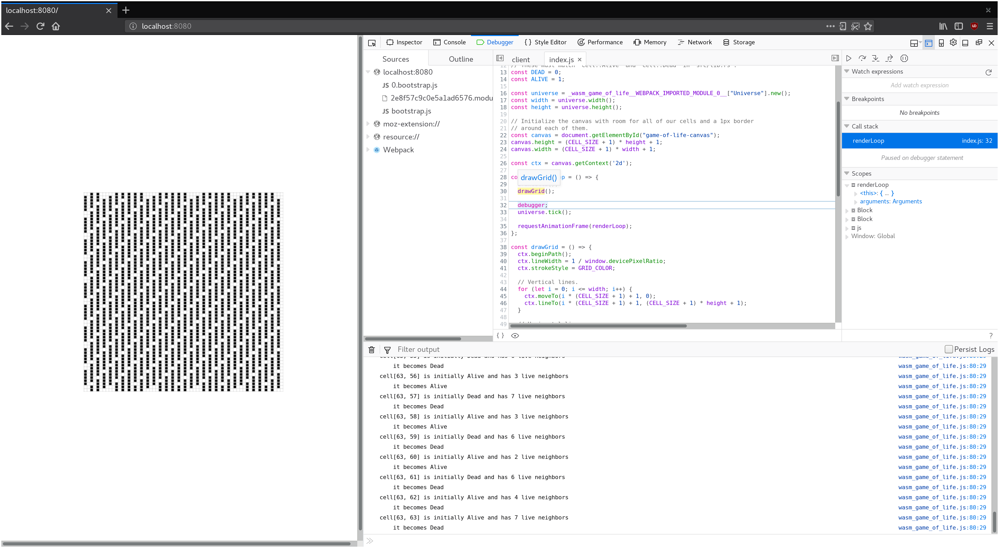

# Debugging

Before we write much more code, we will want to have some debugging tools in our
belt for when things go wrong. Take a moment to review the [reference page
listing tools and approaches available for debugging Rust-generated
WebAssembly][reference-debugging].

[reference-debugging]: ../reference/debugging.html

## Enable Logging for Panics

[If our code panics, we want informative error messages to appear in the
developer console.](../reference/debugging.html#logging-panics)

Our `wasm-pack-template` comes with an optional, enabled-by-default dependency
on [the `console_error_panic_hook` crate][panic-hook] that is configured in
`wasm-game-of-life/src/utils.rs`. All we need to do is install the hook in an
initialization function or common code path. We can call it inside the
`Universe::new` constructor in `wasm-game-of-life/src/lib.rs`:

```rust
pub fn new() -> Universe {
    utils::set_panic_hook();

    // ...
}
```

[panic-hook]: https://github.com/rustwasm/console_error_panic_hook

## Add Logging to our Game of Life

Let's [use the `console.log` function via the `web-sys` crate to add some
logging][logging] about each cell in our `Universe::tick` function.

First, add `web-sys` as a dependency and enable its `"console"` feature in
`wasm-game-of-life/Cargo.toml`:

```toml
[dependencies]

# ...

[dependencies.web-sys]
version = "0.3"
features = [
  "console",
]
```

For ergonomics, we'll wrap the `console.log` function up in a `println!`-style
macro:

[logging]: ../reference/debugging.html#logging-with-the-console-apis

```rust
extern crate web_sys;

// A macro to provide `println!(..)`-style syntax for `console.log` logging.
macro_rules! log {
    ( $( $t:tt )* ) => {
        web_sys::console::log_1(&format!( $( $t )* ).into());
    }
}
```

Now, we can start logging messages to the console by inserting calls to `log` in
Rust code. For example, to log each cell's state, live neighbors count, and next
state, we could modify `wasm-game-of-life/src/lib.rs` like this:

```diff
diff --git a/src/lib.rs b/src/lib.rs
index f757641..a30e107 100755
--- a/src/lib.rs
+++ b/src/lib.rs
@@ -123,6 +122,14 @@ impl Universe {
                 let cell = self.cells[idx];
                 let live_neighbors = self.live_neighbor_count(row, col);

+                log!(
+                    "cell[{}, {}] is initially {:?} and has {} live neighbors",
+                    row,
+                    col,
+                    cell,
+                    live_neighbors
+                );
+
                 let next_cell = match (cell, live_neighbors) {
                     // Rule 1: Any live cell with fewer than two live neighbours
                     // dies, as if caused by underpopulation.
@@ -140,6 +147,8 @@ impl Universe {
                     (otherwise, _) => otherwise,
                 };

+                log!("    it becomes {:?}", next_cell);
+
                 next[idx] = next_cell;
             }
         }
```

## Using a Debugger to Pause Between Each Tick

[Browser's stepping debuggers are useful for inspecting the JavaScript that our
Rust-generated WebAssembly interacts
with.](../reference/debugging.html#using-a-debugger)

For example, we can use the debugger to pause on each iteration of our
`renderLoop` function by placing [a JavaScript `debugger;` statement][dbg-stmt]
above our call to `universe.tick()`.

```js
const renderLoop = () => {
  debugger;
  universe.tick();

  drawGrid();
  drawCells();

  requestAnimationFrame(renderLoop);
};
```

This provides us with a convenient checkpoint for inspecting logged messages,
and comparing the currently rendered frame to the previous one.

[dbg-stmt]: https://developer.mozilla.org/en-US/docs/Web/JavaScript/Reference/Statements/debugger

[](../images/game-of-life/debugging.png)

## Exercises

* Add logging to the `tick` function that records the row and column of each
  cell that transitioned states from live to dead or vice versa.

* Introduce a `panic!()` in the `Universe::new` method. Inspect the panic's
  backtrace in your Web browser's JavaScript debugger. Disable debug symbols,
  rebuild without the `console_error_panic_hook` optional dependency, and
  inspect the stack trace again. Not as useful is it?
