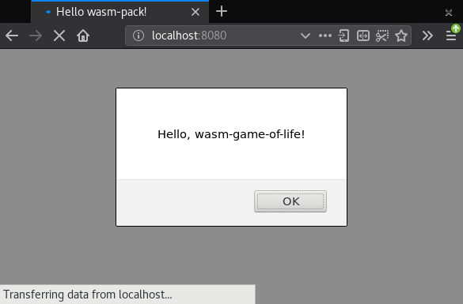

# Hello, World!

This section will show you how to build and run your first Rust and WebAssembly
program: a Web page that alerts "Hello, World!"

Make sure you have followed the [setup instructions](setup.html) before beginning.

## Clone the Project Template

The project template comes pre-configured with sane defaults, so you can quickly
build, integrate, and package your code for the Web.

Clone the project template with this command:

```text
cargo generate --git https://github.com/rustwasm/wasm-pack-template
```

This should prompt you for the new project's name. We will use
**"wasm-game-of-life"**.

```text
wasm-game-of-life
```

## What's Inside

Enter the new `wasm-game-of-life` project

```
cd wasm-game-of-life
```

and let's take a look at its contents:

```text
wasm-game-of-life/
├── Cargo.toml
├── LICENSE_APACHE
├── LICENSE_MIT
├── README.md
└── src
    ├── lib.rs
    └── utils.rs
```

Let's take a look at a couple of these files in detail.

### `wasm-game-of-life/Cargo.toml`

The `Cargo.toml` file specifies dependencies and metadata for `cargo`, Rust's
package manager and build tool. This one comes pre-configured with a
`wasm-bindgen` dependency, a few optional dependencies we will dig into later,
and the `crate-type` properly initialized for generating `.wasm` libraries.

### `wasm-game-of-life/src/lib.rs`

The `src/lib.rs` file is the root of the Rust crate that we are compiling to
WebAssembly. It uses `wasm-bindgen` to interface with JavaScript. It imports the
`window.alert` JavaScript function, and exports the `greet` Rust function, which
alerts a greeting message.

```rust
mod utils;

use wasm_bindgen::prelude::*;

// When the `wee_alloc` feature is enabled, use `wee_alloc` as the global
// allocator.
#[cfg(feature = "wee_alloc")]
#[global_allocator]
static ALLOC: wee_alloc::WeeAlloc = wee_alloc::WeeAlloc::INIT;

#[wasm_bindgen]
extern {
    fn alert(s: &str);
}

#[wasm_bindgen]
pub fn greet() {
    alert("Hello, wasm-game-of-life!");
}
```

### `wasm-game-of-life/src/utils.rs`

The `src/utils.rs` module provides common utilities to make working with Rust
compiled to WebAssembly easier. We will take a look at some of these utilities
in more detail later in the tutorial, such as when we look at [debugging our wasm
code](debugging.html), but we can ignore this file for now.

## Build the Project

We use `wasm-pack` to orchestrate the following build steps:

* Ensure that we have Rust 1.30 or newer and the `wasm32-unknown-unknown`
  target installed via `rustup`,
* Compile our Rust sources into a WebAssembly `.wasm` binary via `cargo`,
* Use `wasm-bindgen` to generate the JavaScript API for using our Rust-generated
  WebAssembly.

To do all of that, run this command inside the project directory:

```
wasm-pack build
```

When the build has completed, we can find its artifacts in the `pkg` directory,
and it should have these contents:

```
pkg/
├── package.json
├── README.md
├── wasm_game_of_life_bg.wasm
├── wasm_game_of_life.d.ts
└── wasm_game_of_life.js
```

The `README.md` file is copied from the main project, but the others are
completely new.

### `wasm-game-of-life/pkg/wasm_game_of_life_bg.wasm`

The `.wasm` file is the WebAssembly binary that is generated by the Rust
compiler from our Rust sources. It contains the compiled-to-wasm versions of all
of our Rust functions and data. For example, it has an exported "greet"
function.

### `wasm-game-of-life/pkg/wasm_game_of_life.js`

The `.js` file is generated by `wasm-bindgen` and contains JavaScript glue for
importing DOM and JavaScript functions into Rust and exposing a nice API to the
WebAssembly functions to JavaScript. For example, there is a JavaScript `greet`
function that wraps the `greet` function exported from the WebAssembly
module. Right now, this glue isn't doing much, but when we start passing more
interesting values back and forth between wasm and JavaScript, it will help
shepherd those values across the boundary.

```js
import * as wasm from './wasm_game_of_life_bg';

// ...

export function greet() {
    return wasm.greet();
}
```

### `wasm-game-of-life/pkg/wasm_game_of_life.d.ts`

The `.d.ts` file contains [TypeScript][] type declarations for the JavaScript
glue. If you are using TypeScript, you can have your calls into WebAssembly
functions type checked, and your IDE can provide autocompletions and
suggestions! If you aren't using TypeScript, you can safely ignore this file.

```typescript
export function greet(): void;
```

[TypeScript]: http://www.typescriptlang.org/

### `wasm-game-of-life/pkg/package.json`

[The `package.json` file contains metadata about the generated JavaScript and
WebAssembly package.][package.json] This is used by npm and JavaScript bundlers
to determine dependencies across packages, package names, versions, and a bunch
of other stuff. It helps us integrate with JavaScript tooling and allows us to
publish our package to npm.

```json
{
  "name": "wasm-game-of-life",
  "collaborators": [
    "Your Name <your.email@example.com>"
  ],
  "description": null,
  "version": "0.1.0",
  "license": null,
  "repository": null,
  "files": [
    "wasm_game_of_life_bg.wasm",
    "wasm_game_of_life.d.ts"
  ],
  "main": "wasm_game_of_life.js",
  "types": "wasm_game_of_life.d.ts"
}
```

[package.json]: https://docs.npmjs.com/files/package.json

## Putting it into a Web Page

To take our `wasm-game-of-life` package and use it in a Web page, we use [the
`create-wasm-app` JavaScript project template][create-wasm-app].

[create-wasm-app]: https://github.com/rustwasm/create-wasm-app

Run this command within the `wasm-game-of-life` directory:

```
npm init wasm-app www
```

Here's what our new `wasm-game-of-life/www` subdirectory contains:

```
wasm-game-of-life/www/
├── bootstrap.js
├── index.html
├── index.js
├── LICENSE-APACHE
├── LICENSE-MIT
├── package.json
├── README.md
└── webpack.config.js
```

Once again, let's take a closer look at some of these files.

### `wasm-game-of-life/www/package.json`

This `package.json` comes pre-configured with `webpack` and `webpack-dev-server`
dependencies, as well as a dependency on `hello-wasm-pack`, which is a version
of the initial `wasm-pack-template` package that has been published to npm.

### `wasm-game-of-life/www/webpack.config.js`

This file configures webpack and its local development server. It comes
pre-configured, and you shouldn't have to tweak this at all to get webpack and
its local development server working.

### `wasm-game-of-life/www/index.html`

This is the root HTML file for the Web page. It doesn't do much other than
load `bootstrap.js`, which is a very thin wrapper around `index.js`.

```html
<!DOCTYPE html>
<html>
  <head>
    <meta charset="utf-8">
    <title>Hello wasm-pack!</title>
  </head>
  <body>
    <script src="./bootstrap.js"></script>
  </body>
</html>
```

### `wasm-game-of-life/www/index.js`

The `index.js` is the main entry point for our Web page's JavaScript. It imports
the `hello-wasm-pack` npm package, which contains the default
`wasm-pack-template`'s compiled WebAssembly and JavaScript glue, then it calls
`hello-wasm-pack`'s `greet` function.

```js
import * as wasm from "hello-wasm-pack";

wasm.greet();
```

### Install the dependencies

First, ensure that the local development server and its dependencies are
installed by running `npm install` within the `wasm-game-of-life/www`
subdirectory:

```text
npm install
```

This command only needs to be run once, and will install the `webpack`
JavaScript bundler and its development server.

> Note that `webpack` is not required for working with Rust and WebAssembly, it
> is just the bundler and development server we've chosen for convenience
> here. Parcel and Rollup should also support importing WebAssembly as
> ECMAScript modules. You can also use Rust and WebAssembly [without a
> bundler][] if you prefer!

[without a bundler]: https://rustwasm.github.io/docs/wasm-bindgen/examples/without-a-bundler.html

### Using our Local `wasm-game-of-life` Package in `www`

Rather than use the `hello-wasm-pack` package from npm, we want to use our local
`wasm-game-of-life` package instead. This will allow us to incrementally develop
our Game of Life program.

Open up `wasm-game-of-life/www/package.json` and next to `"devDependencies"`, add the `"dependencies"` field,
including a `"wasm-game-of-life": "file:../pkg"` entry:

```js
{
  // ...
  "dependencies": {                     // Add this three lines block!
    "wasm-game-of-life": "file:../pkg"
  },
  "devDependencies": {
    //...
  }
}
```

Next, modify `wasm-game-of-life/www/index.js` to import `wasm-game-of-life`
instead of the `hello-wasm-pack` package:

```js
import * as wasm from "wasm-game-of-life";

wasm.greet();
```

Since we declared a new dependency, we need to install it:
```text
npm install
```

Our Web page is now ready to be served locally!

## Serving Locally

Next, open a new terminal for the development server. Running the server in a
new terminal lets us leave it running in the background, and doesn't block us
from running other commands in the meantime. In the new terminal, run this
command from within the `wasm-game-of-life/www` directory:

```
npm run start
```

Navigate your Web browser to [http://localhost:8080/](http://localhost:8080/)
and you should be greeted with an alert message:

[](../images/game-of-life/hello-world.png)

Anytime you make changes and want them reflected on
[http://localhost:8080/](http://localhost:8080/), just re-run the `wasm-pack
build` command within the `wasm-game-of-life` directory.

## Exercises

* Modify the `greet` function in `wasm-game-of-life/src/lib.rs` to take a `name:
  &str` parameter that customizes the alerted message, and pass your name to the
  `greet` function from inside `wasm-game-of-life/www/index.js`. Rebuild the
  `.wasm` binary with `wasm-pack build`, then refresh
  [http://localhost:8080/](http://localhost:8080/) in your Web browser and you
  should see a customized greeting!

  <details>
    <summary>Answer</summary>

    New version of the `greet` function in `wasm-game-of-life/src/lib.rs`:

    ```rust
    #[wasm_bindgen]
    pub fn greet(name: &str) {
        alert(&format!("Hello, {}!", name));
    }
    ```

    New invocation of `greet` in `wasm-game-of-life/www/index.js`:

    ```js
    wasm.greet("Your Name");
    ```

  </details>
