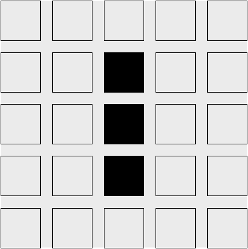
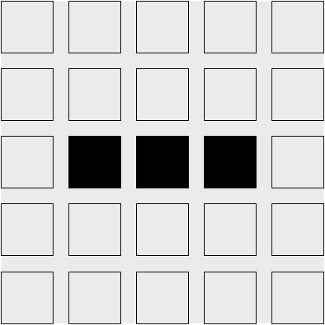

# Rules of Conway's Game of Life

*Note: If you are already familiar with Conway's Game of Life and its rules,
feel free to skip to the next section!*

[Wikipedia gives a great description of the rules of Conway's Game of
Life:][wikipedia]

> The universe of the Game of Life is an infinite two-dimensional orthogonal
> grid of square cells, each of which is in one of two possible states, alive or
> dead, or "populated" or "unpopulated". Every cell interacts with its eight
> neighbours, which are the cells that are horizontally, vertically, or
> diagonally adjacent. At each step in time, the following transitions occur:
>
> 1. Any live cell with fewer than two live neighbours dies, as if caused by
>    underpopulation.
>
> 2. Any live cell with two or three live neighbours lives on to the next
>    generation.
>
> 3. Any live cell with more than three live neighbours dies, as if by
>    overpopulation.
>
> 4. Any dead cell with exactly three live neighbours becomes a live cell, as if
>    by reproduction.
>
> The initial pattern constitutes the seed of the system. The first generation
> is created by applying the above rules simultaneously to every cell in the
> seed—births and deaths occur simultaneously, and the discrete moment at which
> this happens is sometimes called a tick (in other words, each generation is a
> pure function of the preceding one). The rules continue to be applied
> repeatedly to create further generations.

[wikipedia]: https://en.wikipedia.org/wiki/Conway%27s_Game_of_Life

Consider the following initial universe:

We can calculate the next generation by considering each cell. The top left cell
is dead. Rule (4) is the only transition rule that applies to dead
cells. However, because the top left cell does not have exactly three live
neighbors, the transition rule does not apply, and it remains dead in the next
generation. The same goes for every other cell in the first row as well.

Things get interesting when we consider the top live cell, in the second row,
third column. For live cells, any of the first three rules potentially
applies. In this cell's case, it has only one live neighbor, and therefore rule
(1) applies: this cell will die in the next generation. The same fate awaits the
bottom live cell.

The middle live cell has two live neighbors: the top and bottom live cells. This
means that rule (2) applies, and it remains live in the next generation.

The final interesting cases are the dead cells just to the left and right of the
middle live cell. The three live cells are all neighbors both of these cells,
which means that rule (4) applies, and these cells will become alive in the next
generation.

Put it all together, and we get this universe after the next tick:

From these simple, deterministic rules, strange and exciting behavior emerges:

| Gosper's glider gun | Pulsar | Space ship |
|---|---|---|
|  |  |  |

<iframe width="560" height="315" src="https://www.youtube.com/embed/C2vgICfQawE?rel=0&amp;start=65" frameborder="0" allow="autoplay; encrypted-media" allowfullscreen></iframe>

## Exercises

* Compute by hand the next tick of our example universe. Notice anything
  familiar?

  

    
Answer

    It should be the initial state of the example universe:

    

    This pattern is *periodic*: it returns to the initial state after every two
    ticks.

  

* Can you find an initial universe that is stable? That is, a universe in which
  every generation is always the same.

  

    
Answer

    There are an infinite number of stable universes! The trivially stable
    universe is the empty universe. A two-by-two square of live cells is also a
    stable universe.

  

