# Time Profiling

In this chapter, we will improve the performance of our Game of Life
implementation. We will use time profiling to guide our efforts.

Familiarize yourself with [the available tools for time profiling Rust and
WebAssembly code](../reference/time-profiling.md) before continuing.

## Creating a Frames Per Second Timer with the `window.performance.now` Function

This FPS timer will be useful as we investigate speeding up our Game of Life's
rendering.

We start by adding an `fps` object to `wasm-game-of-life/www/index.js`:

```js
const fps = new class {
  constructor() {
    this.fps = document.getElementById("fps");
    this.frames = [];
    this.lastFrameTimeStamp = performance.now();
  }

  render() {
    // Convert the delta time since the last frame render into a measure
    // of frames per second.
    const now = performance.now();
    const delta = now - this.lastFrameTimeStamp;
    this.lastFrameTimeStamp = now;
    const fps = 1 / delta * 1000;

    // Save only the latest 100 timings.
    this.frames.push(fps);
    if (this.frames.length > 100) {
      this.frames.shift();
    }

    // Find the max, min, and mean of our 100 latest timings.
    let min = Infinity;
    let max = -Infinity;
    let sum = 0;
    for (let i = 0; i < this.frames.length; i++) {
      sum += this.frames[i];
      min = Math.min(this.frames[i], min);
      max = Math.max(this.frames[i], max);
    }
    let mean = sum / this.frames.length;

    // Render the statistics.
    this.fps.textContent = `
Frames per Second:
         latest = ${Math.round(fps)}
avg of last 100 = ${Math.round(mean)}
min of last 100 = ${Math.round(min)}
max of last 100 = ${Math.round(max)}
`.trim();
  }
};
```

Next we call the `fps` `render` function on each iteration of `renderLoop`:

```js
const renderLoop = () => {
    fps.render(); //new

    universe.tick();
    drawGrid();
    drawCells();

    animationId = requestAnimationFrame(renderLoop);
};
```

Finally, don't forget to add the `fps` element to
`wasm-game-of-life/www/index.html`, just above the `<canvas>`:

```html
<div id="fps"></div>
```

And add CSS to make its formatting nice:

```css
#fps {
  white-space: pre;
  font-family: monospace;
}
```

And voila! Refresh [http://localhost:8080](http://localhost:8080) and now we
have an FPS counter!

[perf-now]: https://developer.mozilla.org/en-US/docs/Web/API/Performance/now

### Time Each `Universe::tick` with `console.time` and `console.timeEnd`

To measure how long each invocation of `Universe::tick` takes, we can use
`console.time` and `console.timeEnd` via the `web-sys` crate.

First, add `web-sys` as a dependency to `wasm-game-of-life/Cargo.toml`:

```toml
[dependencies.web-sys]
version = "0.3"
features = [
  "console",
]
```

Because there should be a corresponding `console.timeEnd` invocation for every
`console.time` call, it is convenient to wrap them both up in an [RAII][] type:

```rust
extern crate web_sys;
use web_sys::console;

pub struct Timer<'a> {
    name: &'a str,
}

impl<'a> Timer<'a> {
    pub fn new(name: &'a str) -> Timer<'a> {
        console::time_with_label(name);
        Timer { name }
    }
}

impl<'a> Drop for Timer<'a> {
    fn drop(&mut self) {
        console::time_end_with_label(self.name);
    }
}
```

Then, we can time how long each `Universe::tick` takes by adding this snippet to
the top of the method:

```rust
let _timer = Timer::new("Universe::tick");
```

The time of how long each call to `Universe::tick` took are now logged in the
console:

[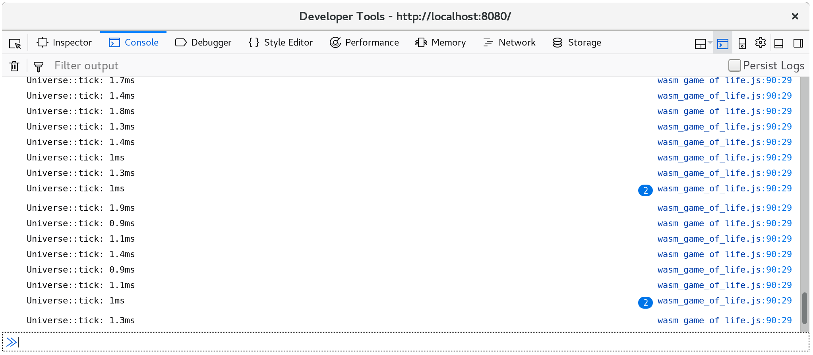](../images/game-of-life/console-time.png)

Additionally, `console.time` and `console.timeEnd` pairs will show up in your
browser's profiler's "timeline" or "waterfall" view:

[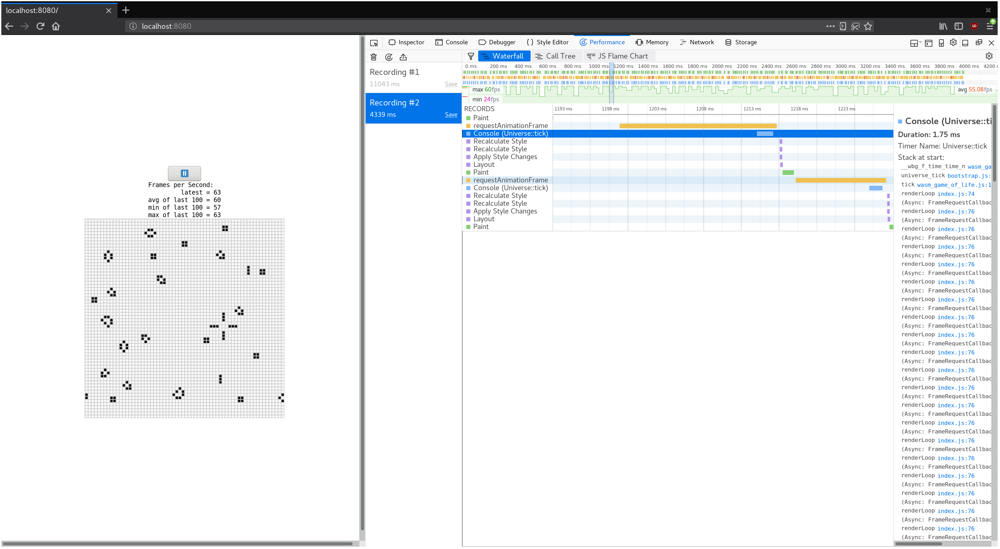](../images/game-of-life/console-time-in-profiler.png)

[RAII]: https://en.wikipedia.org/wiki/Resource_acquisition_is_initialization

## Growing our Game of Life Universe

> ⚠️ This section utilizes example screenshots from Firefox. While all modern
> browsers have similar tools, there might be slight nuances to working with
> different developer tools. The profile information you extract will be
> essentially the same, but your mileage might vary in terms of the views you
> see and the naming of different tools.

What happens if we make our Game of Life universe larger? Replacing the 64 by 64
universe with a 128 by 128 universe (by modifying `Universe::new` in
`wasm-game-of-life/src/lib.rs`) results in FPS dropping from a smooth 60 to a
choppy 40-ish on my machine.

If we record a profile and look at the waterfall view, we see that each
animation frame is taking over 20 milliseconds. Recall that 60 frames per second
leaves sixteen milliseconds for the whole process of rendering a frame. That's
not just our JavaScript and WebAssembly, but also everything else the browser is
doing, such as painting.

[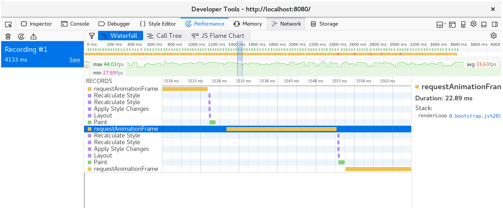](../images/game-of-life/drawCells-before-waterfall.png)

If we look at what happens within a single animation frame, we see that the
`CanvasRenderingContext2D.fillStyle` setter is very expensive!

> ⚠️ In Firefox, if you see a line that simply says "DOM" instead of the
> `CanvasRenderingContext2D.fillStyle` mentioned above, you may need to turn on
> the option for "Show Gecko Platform Data" in your performance developer tools
> options:
>
> [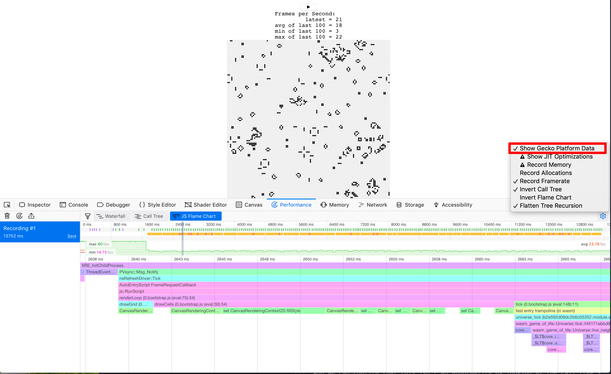](../images/game-of-life/profiler-firefox-show-gecko-platform.png)

[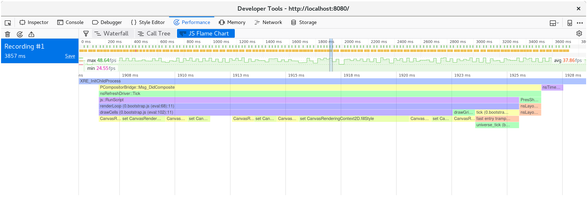](../images/game-of-life/drawCells-before-flamegraph.png)

And we can confirm that this isn't an abnormality by looking at the call tree's
aggregation of many frames:

[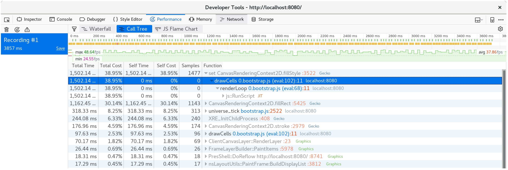](../images/game-of-life/drawCells-before-calltree.png)

Nearly 40% of our time is spent in this setter!

> ⚡ We might have expected something in the `tick` method to be the performance
> bottleneck, but it wasn't. Always let profiling guide your focus, since time
> may be spent in places you don't expect it to be.

In the `drawCells` function in `wasm-game-of-life/www/index.js`, the `fillStyle`
property is set once for every cell in the universe, on every animation frame:

```js
for (let row = 0; row < height; row++) {
  for (let col = 0; col < width; col++) {
    const idx = getIndex(row, col);

    ctx.fillStyle = cells[idx] === DEAD
      ? DEAD_COLOR
      : ALIVE_COLOR;

    ctx.fillRect(
      col * (CELL_SIZE + 1) + 1,
      row * (CELL_SIZE + 1) + 1,
      CELL_SIZE,
      CELL_SIZE
    );
  }
}
```

Now that we have discovered that setting `fillStyle` is so expensive, what can
we do to avoid setting it so often? We need to change `fillStyle` depending on
whether a cell is alive or dead. If we set `fillStyle = ALIVE_COLOR` and then
draw every alive cell in one pass, and then set `fillStyle = DEAD_COLOR` and
draw every dead cell in another pass, then we only end setting `fillStyle`
twice, rather than once for every cell.

```js
// Alive cells.
ctx.fillStyle = ALIVE_COLOR;
for (let row = 0; row < height; row++) {
  for (let col = 0; col < width; col++) {
    const idx = getIndex(row, col);
    if (cells[idx] !== Cell.Alive) {
      continue;
    }

    ctx.fillRect(
      col * (CELL_SIZE + 1) + 1,
      row * (CELL_SIZE + 1) + 1,
      CELL_SIZE,
      CELL_SIZE
    );
  }
}

// Dead cells.
ctx.fillStyle = DEAD_COLOR;
for (let row = 0; row < height; row++) {
  for (let col = 0; col < width; col++) {
    const idx = getIndex(row, col);
    if (cells[idx] !== Cell.Dead) {
      continue;
    }

    ctx.fillRect(
      col * (CELL_SIZE + 1) + 1,
      row * (CELL_SIZE + 1) + 1,
      CELL_SIZE,
      CELL_SIZE
    );
  }
}
```

After saving these changes and refreshing
[http://localhost:8080/](http://localhost:8080/), rendering is back to a smooth
60 frames per second.

If we take another profile, we can see that only about ten milliseconds are
spent in each animation frame now.

[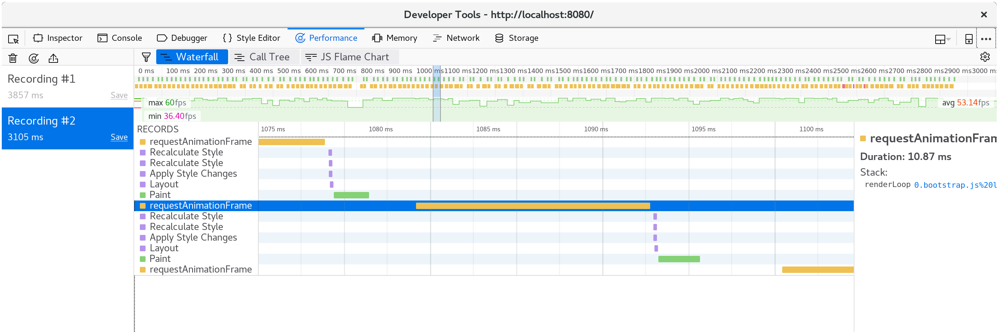](../images/game-of-life/drawCells-after-waterfall.png)

Breaking down a single frame, we see that the `fillStyle` cost is gone, and most
of our frame's time is spent within `fillRect`, drawing each cell's rectangle.

[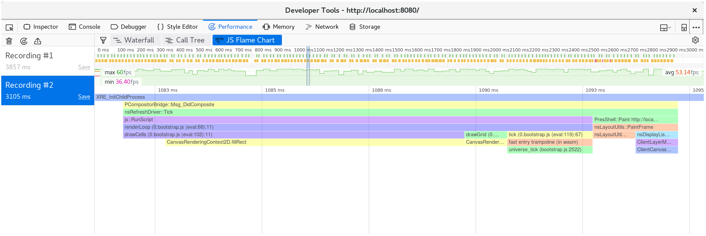](../images/game-of-life/drawCells-after-flamegraph.png)

## Making Time Run Faster

Some folks don't like waiting around, and would prefer if instead of one tick of
the universe occurred per animation frame, nine ticks did. We can modify the
`renderLoop` function in `wasm-game-of-life/www/index.js` to do this quite
easily:

```js
for (let i = 0; i < 9; i++) {
  universe.tick();
}
```

On my machine, this brings us back down to only 35 frames per second. No
good. We want that buttery 60!

Now we know that time is being spent in `Universe::tick`, so let's add some
`Timer`s to wrap various bits of it in `console.time` and `console.timeEnd`
calls, and see where that leads us. My hypothesis is that allocating a new
vector of cells and freeing the old vector on every tick is costly, and taking
up a significant portion of our time budget.

```rust
pub fn tick(&mut self) {
    let _timer = Timer::new("Universe::tick");

    let mut next = {
        let _timer = Timer::new("allocate next cells");
        self.cells.clone()
    };

    {
        let _timer = Timer::new("new generation");
        for row in 0..self.height {
            for col in 0..self.width {
                let idx = self.get_index(row, col);
                let cell = self.cells[idx];
                let live_neighbors = self.live_neighbor_count(row, col);

                let next_cell = match (cell, live_neighbors) {
                    // Rule 1: Any live cell with fewer than two live neighbours
                    // dies, as if caused by underpopulation.
                    (Cell::Alive, x) if x < 2 => Cell::Dead,
                    // Rule 2: Any live cell with two or three live neighbours
                    // lives on to the next generation.
                    (Cell::Alive, 2) | (Cell::Alive, 3) => Cell::Alive,
                    // Rule 3: Any live cell with more than three live
                    // neighbours dies, as if by overpopulation.
                    (Cell::Alive, x) if x > 3 => Cell::Dead,
                    // Rule 4: Any dead cell with exactly three live neighbours
                    // becomes a live cell, as if by reproduction.
                    (Cell::Dead, 3) => Cell::Alive,
                    // All other cells remain in the same state.
                    (otherwise, _) => otherwise,
                };

                next[idx] = next_cell;
            }
        }
    }

    let _timer = Timer::new("free old cells");
    self.cells = next;
}
```

Looking at the timings, it is clear that my hypothesis is incorrect: the vast
majority of time is spent actually calculating the next generation of
cells. Allocating and freeing a vector on every tick appears to have negligible
cost, surprisingly. Another reminder to always guide our efforts with profiling!

[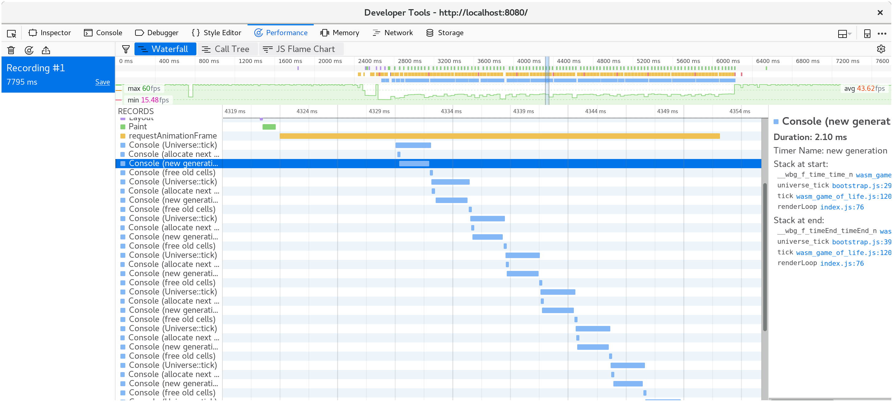](../images/game-of-life/console-time-in-universe-tick.png)

The next section requires the `nightly` compiler. It's required because of
the [test feature gate](https://doc.rust-lang.org/unstable-book/library-features/test.html)
we're going to use for the benchmarks. Another tool we will install is [cargo benchcmp][benchcmp].
It's a small utility for comparing micro-benchmarks produced by `cargo bench`.

[benchcmp]: https://github.com/BurntSushi/cargo-benchcmp

Let's write a native code `#[bench]` doing the same thing that our WebAssembly
is doing, but where we can use more mature profiling tools. Here is the new
`wasm-game-of-life/benches/bench.rs`:

```rust
#![feature(test)]

extern crate test;
extern crate wasm_game_of_life;

#[bench]
fn universe_ticks(b: &mut test::Bencher) {
    let mut universe = wasm_game_of_life::Universe::new();

    b.iter(|| {
        universe.tick();
    });
}
```

We also have to comment out all the `#[wasm_bindgen]` annotations, and the
`"cdylib"` bits from `Cargo.toml` or else building native code will fail and
have link errors.

With all that in place, we can run `cargo bench | tee before.txt` to compile and run our
benchmark! The `| tee before.txt` part will take the output from `cargo bench` and put in a file
called `before.txt`.

```
$ cargo bench | tee before.txt
    Finished release [optimized + debuginfo] target(s) in 0.0 secs
     Running target/release/deps/wasm_game_of_life-91574dfbe2b5a124

running 0 tests

test result: ok. 0 passed; 0 failed; 0 ignored; 0 measured; 0 filtered out

     Running target/release/deps/bench-8474091a05cfa2d9

running 1 test
test universe_ticks ... bench:     664,421 ns/iter (+/- 51,926)

test result: ok. 0 passed; 0 failed; 0 ignored; 1 measured; 0 filtered out
```

This also tells us where the binary lives, and we can run the benchmarks again,
but this time under our operating system's profiler. In my case, I'm running
Linux, so [`perf`][perf] is the profiler I'll use:

[perf]: https://perf.wiki.kernel.org/index.php/Main_Page

```
$ perf record -g target/release/deps/bench-8474091a05cfa2d9 --bench
running 1 test
test universe_ticks ... bench:     635,061 ns/iter (+/- 38,764)

test result: ok. 0 passed; 0 failed; 0 ignored; 1 measured; 0 filtered out

[ perf record: Woken up 1 times to write data ]
[ perf record: Captured and wrote 0.178 MB perf.data (2349 samples) ]
```

Loading up the profile with `perf report` shows that all of our time is spent in
`Universe::tick`, as expected:

[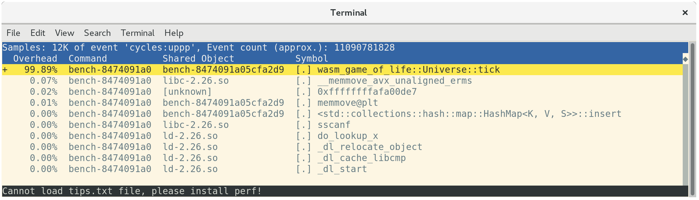](../images/game-of-life/bench-perf-report.png)

`perf` will annotate which instructions in a function time is being spent at if
you press `a`:

[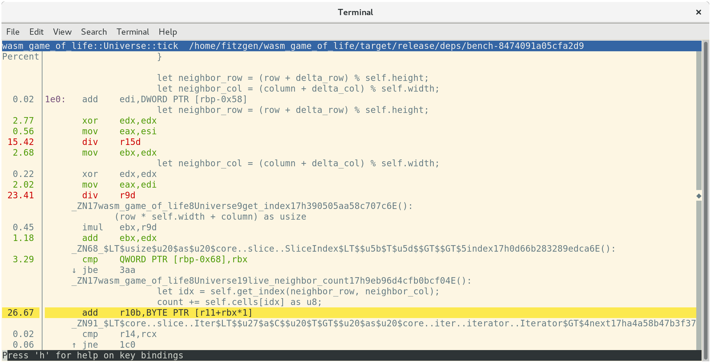](../images/game-of-life/bench-perf-annotate.png)

This tells us that 26.67% of time is being spent summing neighboring cells'
values, 23.41% of time is spent getting the neighbor's column index, and another
15.42% of time is spent getting the neighbor's row index. Of these top three
most expensive instructions, the second and third are both costly `div`
instructions. These `div`s implement the modulo indexing logic in
`Universe::live_neighbor_count`.

Recall the `live_neighbor_count` definition inside
`wasm-game-of-life/src/lib.rs`:

```rust
fn live_neighbor_count(&self, row: u32, column: u32) -> u8 {
    let mut count = 0;
    for delta_row in [self.height - 1, 0, 1].iter().cloned() {
        for delta_col in [self.width - 1, 0, 1].iter().cloned() {
            if delta_row == 0 && delta_col == 0 {
                continue;
            }

            let neighbor_row = (row + delta_row) % self.height;
            let neighbor_col = (column + delta_col) % self.width;
            let idx = self.get_index(neighbor_row, neighbor_col);
            count += self.cells[idx] as u8;
        }
    }
    count
}
```

The reason we used modulo was to avoid cluttering up the code with `if` branches
for the first or last row or column edge cases. But we are paying the cost of a
`div` instruction even for the most common case, when neither `row` nor `column`
is on the edge of the universe and they don't need the modulo wrapping
treatment. Instead, if we use `if`s for the edge cases and unroll this loop, the
branches *should* be very well-predicted by the CPU's branch predictor.

Let's rewrite `live_neighbor_count` like this:

```rust
fn live_neighbor_count(&self, row: u32, column: u32) -> u8 {
    let mut count = 0;

    let north = if row == 0 {
        self.height - 1
    } else {
        row - 1
    };

    let south = if row == self.height - 1 {
        0
    } else {
        row + 1
    };

    let west = if column == 0 {
        self.width - 1
    } else {
        column - 1
    };

    let east = if column == self.width - 1 {
        0
    } else {
        column + 1
    };

    let nw = self.get_index(north, west);
    count += self.cells[nw] as u8;

    let n = self.get_index(north, column);
    count += self.cells[n] as u8;

    let ne = self.get_index(north, east);
    count += self.cells[ne] as u8;

    let w = self.get_index(row, west);
    count += self.cells[w] as u8;

    let e = self.get_index(row, east);
    count += self.cells[e] as u8;

    let sw = self.get_index(south, west);
    count += self.cells[sw] as u8;

    let s = self.get_index(south, column);
    count += self.cells[s] as u8;

    let se = self.get_index(south, east);
    count += self.cells[se] as u8;

    count
}
```

Now let's run the benchmarks again! This time output it to `after.txt`.

```
$ cargo bench | tee after.txt
   Compiling wasm_game_of_life v0.1.0 (file:///home/fitzgen/wasm_game_of_life)
    Finished release [optimized + debuginfo] target(s) in 0.82 secs
     Running target/release/deps/wasm_game_of_life-91574dfbe2b5a124

running 0 tests

test result: ok. 0 passed; 0 failed; 0 ignored; 0 measured; 0 filtered out

     Running target/release/deps/bench-8474091a05cfa2d9

running 1 test
test universe_ticks ... bench:      87,258 ns/iter (+/- 14,632)

test result: ok. 0 passed; 0 failed; 0 ignored; 1 measured; 0 filtered out
```

That looks a whole lot better! We can see just how much better it is with the `benchcmp` tool and the two text files we created before:

```
$ cargo benchcmp before.txt after.txt
 name            before.txt ns/iter  after.txt ns/iter  diff ns/iter   diff %  speedup
 universe_ticks  664,421             87,258                 -577,163  -86.87%   x 7.61
```

Wow! 7.61x speed up!

WebAssembly intentionally maps closely to common hardware architectures, but we
do need to make sure that this native code speed up translates into a
WebAssembly speed up as well.

Let's rebuild the `.wasm` with `wasm-pack build` and refresh
[http://localhost:8080/](http://localhost:8080/). On my machine, the page is
running at 60 frames per second again, and recording another profile with the
browser's profiler reveals that each animation frame is taking about ten
milliseconds.

Success!

[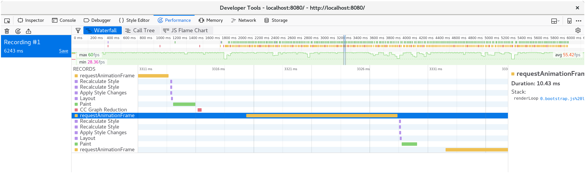](../images/game-of-life/waterfall-after-branches-and-unrolling.png)

## Exercises

* At this point, the next lowest hanging fruit for speeding up `Universe::tick`
  is removing the allocation and free. Implement double buffering of cells,
  where the `Universe` maintains two vectors, never frees either of them, and
  never allocates new buffers in `tick`.

* Implement the alternative, delta-based design from the "Implementing Life"
  chapter, where the Rust code returns a list of cells that changed states to
  JavaScript. Does this make rendering to `<canvas>` faster? Can you implement
  this design without allocating a new list of deltas on every tick?

* As our profiling has shown us, 2D `<canvas>` rendering is not particularly
  fast. Replace the 2D canvas renderer with a [WebGL][webgl] renderer. How much faster is
  the WebGL version? How large can you make the universe before WebGL rendering
  is a bottleneck?

[webgl]: https://developer.mozilla.org/en-US/docs/Web/API/WebGL_API
