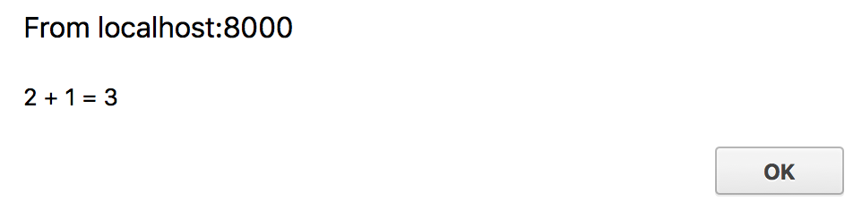

# "Hello World" for `wasm32-unknown-unknown`

A basic "hello world" can be generated with:

```
$ cargo +nightly new --lib hello-world
```

Next up change `Cargo.toml` to have:

```toml
[lib]
crate-type = ["cdylib"]
```

and edit `src/lib.rs` to contain:

```rust
#[no_mangle]
pub extern fn add_one(a: u32) -> u32 {
    a + 1
}
```

Now prepare the wasm binary with:

```
$ cargo +nightly build --target wasm32-unknown-unknown --release

# make the binary smaller by removing all unneeded exports, imports, and functions 
# (working around bugs in rustc toolchain)
$ wasm-gc target/wasm32-unknown-unknown/release/hello_world.wasm -o hello_world.gc.wasm

# make the binary *even smaller* if you installed `wasm-opt`
$ wasm-opt -Os hello_world.gc.wasm -o hello_world.gc.opt.wasm
```

And we can test it out with:

```html
<!DOCTYPE html>
<html>
  <head>
    <script>
      WebAssembly.instantiateStreaming(fetch('hello_world.gc.opt.wasm'))
        .then(wasm_module => {
            alert(`2 + 1 = ${wasm_module.instance.exports.add_one(2)}`);
        });
    </script>
  </head>
  <body></body>
</html>
```

Note: To run with `instantiateStreaming` and `compileStreaming`, you need your webserver to serve `.wasm` file with `application/wasm` MIME type. The [https](https://github.com/thecoshman/http) crate can be used to serve files from `localhost`, and includes the `application/wasm` MIME type out of the box.

Alternatively, if you are running locally without any webserver.

```html
<!DOCTYPE html>
<html>
  <head>
    <script>
      fetch('hello_world.gc.opt.wasm')
        .then(r => r.arrayBuffer())
        .then(r => WebAssembly.instantiate(r))
        .then(wasm_module => {
            alert(`2 + 1 = ${wasm_module.instance.exports.add_one(2)}`);
        });
    </script>
  </head>
  <body></body>
</html>
```

If you have Python 3 installed, you can alternatively serve this file with Python's built 
in web server from `localhost`. Python's web server cannot serve `instantiateStreaming` or 
`compileStreaming` due to its lack of support for the `application/wasm` MIME type.

```
$ python3 -m http.server
```

Ensure that your browser supports Wasm. Two options:

- Run this [StackOverflow code snippet](https://stackoverflow.com/a/47880734)

- Search for your browser version's Wasm support on [caniuse.com](https://caniuse.com/#search=wasm)

Open the HTML file with your browser, you should see:


